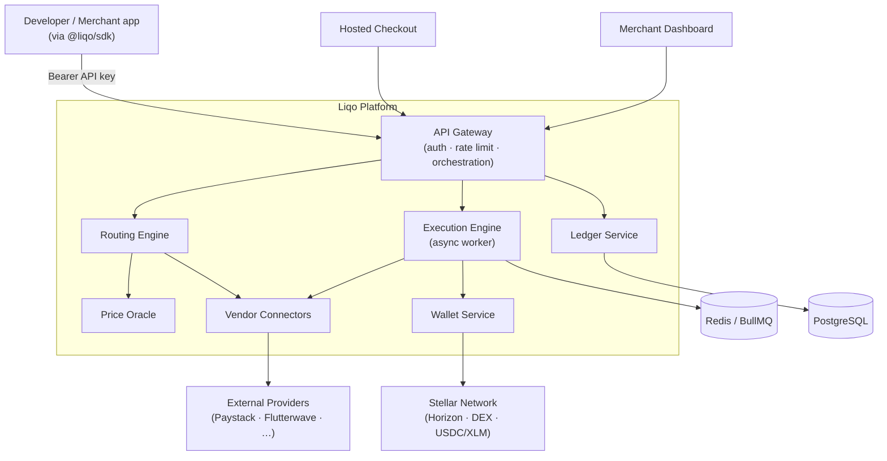

<div align="center">


### Global Payments Infrastructure for Modern Businesses

**Move money globally without the technical heavy lifting.**

Accept payments in crypto or fiat from anywhere in the world and settle in your preferred currency — through a single API.

[](./LICENSE)
[](./SCF.md)
[](https://nextjs.org)
[](https://www.typescriptlang.org)
[](./CONTRIBUTING.md)
[](./CODE_OF_CONDUCT.md)

[Website](https://liqo.network) · [Documentation](./docs/README.md) · [Vision](./VISION.md) · [Stellar / SCF](./SCF.md) · [Roadmap](./docs/ROADMAP.md)

</div>

---

> **This repository** hosts the **Liqo marketing website and public documentation** (`liqo.network`). It is the open, public face of the Liqo project. The core payments platform, SDK, dashboard, and checkout live in separate repositories — see [Repository Structure](#repository-structure).

---

## Table of Contents

- [What is Liqo?](#what-is-liqo)
- [The Problem](#the-problem)
- [Why Liqo Exists](#why-liqo-exists)
- [Mission](#mission)
- [Why Stellar](#why-stellar)
- [Key Features](#key-features)
- [Product Overview](#product-overview)
- [Architecture Overview](#architecture-overview)
- [Screenshots](#screenshots)
- [Technology Stack](#technology-stack)
- [Repository Structure](#repository-structure)
- [Local Development](#local-development)
- [Environment Variables](#environment-variables)
- [Running in Production](#running-in-production)
- [Documentation](#documentation)
- [Roadmap](#roadmap)
- [Contributing](#contributing)
- [Security](#security)
- [License](#license)
- [Contact](#contact)

---

## What is Liqo?

**Liqo is Global Payments Infrastructure for Modern Businesses.** It lets a business accept payments in fiat, stablecoins, or crypto from users anywhere and settle in the asset it actually wants — without holding token reserves, running a treasury, or stitching together exchanges, payment processors, and on-chain settlement.

A platform integrates Liqo **once**. After that, a single API call handles the rest:

```ts
await liqo.convert({
  from: "NGN",
  to: "XLM",
  amount: 50000,
  recipient: "G...WALLET",
});
```

Liqo finds the best route, converts through external liquidity and payment partners, and delivers the requested asset to the destination — reliably, and with the complexity abstracted away.

## The Problem

Any product that wants to move money across currencies and assets — wallet top-ups, creator tips, remittances, marketplace payouts, payroll — today has to:

- Pre-fund crypto inventory and manage treasury risk
- Integrate and reconcile multiple exchanges and payment processors
- Build routing, execution, and settlement logic in-house
- Handle failures, retries, and compliance across fragmented corridors

This is months of financial engineering that has nothing to do with the product itself.

## Why Liqo Exists

Liqo removes that entire burden. Platforms should be able to offer cross-currency and cross-asset transactions through a **single orchestration layer** — accept fiat, route intelligently, settle reliably — and get back to building their product.

## Mission

> To become the operating system for how products move money between fiat, stablecoins, and digital assets — especially across the markets and corridors that are fragmented, underserved, or operationally difficult.

Read the full [Vision](./VISION.md).

## Why Stellar

Liqo settles on **Stellar** because it is purpose-built for payments:

- **Fast, low-cost settlement** — payments finalize in seconds for fractions of a cent, which matters for micro-transactions like tips and top-ups.
- **Native stablecoin and DEX primitives** — USDC and the built-in Stellar DEX give Liqo on-chain liquidity and path payments out of the box.
- **Real-world assets & anchors** — Stellar's anchor network aligns directly with Liqo's fiat on/off-ramp thesis in emerging markets.

XLM is Liqo's first settlement rail. See [Stellar Integration](./docs/STELLAR_INTEGRATION.md) and the [SCF overview](./SCF.md).

## Key Features

- 🌍 **Global fiat + crypto acceptance** — pay-in from local currencies (USD, NGN, GHS, GBP, EUR, ZAR) or crypto.
- 🧭 **Intelligent liquidity routing** — the routing engine ranks paths by price, fees, slippage, latency, and provider reliability.
- 🏦 **Reserve-less settlement** — no pre-funded inventory; Liqo routes through external liquidity and settles on-chain.
- ⚡ **Stellar settlement** — fast, low-cost delivery of XLM/USDC to any destination wallet.
- 🔌 **One API, one SDK** — quote, convert, checkout, and webhooks via `@liqo/sdk`.
- 🧾 **Hosted checkout** — drop-in payment pages for fiat on-ramp flows.
- 📊 **Merchant dashboard** — organizations, projects, API keys, transactions, and webhooks.
- 🔐 **Security-first** — HMAC-hashed API keys, signed webhooks, scoped access, rate limiting.

## Product Overview

| Surface | What it does | Repository |
|---|---|---|
| **Payments API** | Quote, convert, payout, transactions | `liqo-platform` |
| **Routing Engine** | Path generation + cost/reliability scoring | `liqo-platform` |
| **Settlement** | Stellar Horizon settlement & wallet ops | `liqo-platform` |
| **SDK** | `@liqo/sdk` — typed client + webhook verification | `liqo-sdk` |
| **Checkout** | Hosted fiat payment pages | `liqo-checkout` |
| **Dashboard** | Developer / merchant control plane | `liqo-dashboard` |
| **Website** | Marketing site + waitlist + docs | `liqo-landing` *(this repo)* |

Full detail in [Product](./PRODUCT.md).

## Architecture Overview

Liqo is a service-oriented platform. A single public API gateway fronts a set of internal services; conversions run asynchronously through a queue and settle on Stellar.



See [Architecture](./docs/ARCHITECTURE.md) and [System Design](./docs/SYSTEM_DESIGN.md) for the full breakdown, and [Payment Orchestration](./docs/PAYMENT_ORCHESTRATION.md) for the request lifecycle.

## Screenshots

> Product screenshots for this site live in [`public/`](./public) (e.g. `overview-screenshot.png`, `og-image.png`). Product UI captures should be added to [`docs/`](./docs) as the dashboard and checkout mature — see [`PRESS.md`](./PRESS.md) for the approved media kit.

## Technology Stack

**This website**

- [Next.js 16](https://nextjs.org) (App Router) + [React 19](https://react.dev)
- [TypeScript](https://www.typescriptlang.org)
- [Tailwind CSS v4](https://tailwindcss.com) + [shadcn](https://ui.shadcn.com) / [Base UI](https://base-ui.com)
- [Framer Motion](https://www.framer.com/motion/) and [three.js](https://threejs.org) / [react-three-fiber](https://r3f.docs.pmnd.rs/) for the animated hero
- [react-hook-form](https://react-hook-form.com) + [Zod](https://zod.dev) for the waitlist
- Font: [Outfit](https://fonts.google.com/specimen/Outfit)

**The platform** (separate repos): Node.js + TypeScript, PostgreSQL, Redis, BullMQ, `@stellar/stellar-sdk`, Prometheus + Grafana + Sentry, Docker.

## Repository Structure

```
liqo-landing/                 # this repo — marketing site + public docs
├── app/                      # Next.js App Router (pages, waitlist API route, SEO routes)
│   ├── page.tsx              # landing page
│   ├── waitlist/             # waitlist page
│   └── api/waitlist/         # waitlist submission handler
├── components/               # sections/, ui/, waitlist/
├── hooks/                    # React hooks (e.g. use-scrolled)
├── lib/                      # seo/, data/, waitlist/, api/, utils
├── public/                   # brand assets, logos, screenshots, OG image
├── docs/                     # public documentation (see docs/README.md)
├── VISION.md · PRODUCT.md · SCF.md · BRAND.md · PRESS.md · OPEN_SOURCE.md
└── README.md
```

**The Liqo ecosystem**

| Repository | Purpose | Visibility |
|---|---|---|
| [`liqo-platform`](https://github.com/liqoprotocol/liqo-platform) | Core payments platform (microservices) | Private |
| [`liqo-sdk`](https://github.com/liqoprotocol/liqo-sdk) | `@liqo/sdk` TypeScript client | Public |
| [`liqo-dashboard`](https://github.com/liqoprotocol/liqo-dashboard) | Developer / merchant dashboard | Private |
| `liqo-checkout` | Hosted checkout UI | Private |
| **`liqo-landing`** | Marketing site + public docs *(this repo)* | Public |

## Local Development

**Requirements:** [Node.js](https://nodejs.org) ≥ 20 and [pnpm](https://pnpm.io) ≥ 9 (this repo uses a pnpm workspace).

```bash
# 1. Clone
git clone https://github.com/liqoprotocol/liqo-landing.git
cd liqo-landing

# 2. Install dependencies
pnpm install

# 3. Start the dev server
pnpm dev
```

Open [http://localhost:3000](http://localhost:3000).

**Scripts**

| Command | Description |
|---|---|
| `pnpm dev` | Start the development server |
| `pnpm build` | Production build |
| `pnpm start` | Serve the production build |
| `pnpm lint` | Run ESLint |

See [docs/DEPLOYMENT.md](./docs/DEPLOYMENT.md) for the full developer-experience guide (testing, linting, troubleshooting).

## Environment Variables

This site runs with **zero required environment variables** for local development. Optional variables enable integrations:

| Variable | Required | Description |
|---|---|---|
| `NEXT_PUBLIC_SITE_URL` | No | Canonical site URL (defaults to `https://liqo.network`) |
| `NEXT_PUBLIC_GOOGLE_SITE_VERIFICATION` | No | Search Console verification token |

> The waitlist API route currently uses an in-memory store for local development. Configure a persistence provider (database or email service provider) before production — see [docs/DEPLOYMENT.md](./docs/DEPLOYMENT.md). **Never commit secrets;** `.env*` files are gitignored.

## Running in Production

The site is a standard Next.js application and deploys to any Next-compatible host (Vercel recommended):

```bash
pnpm build
pnpm start   # or deploy the build output to your platform
```

See [docs/DEPLOYMENT.md](./docs/DEPLOYMENT.md).

## Documentation

Full documentation lives in [`docs/`](./docs/README.md):

- [Introduction](./docs/INTRODUCTION.md) · [Architecture](./docs/ARCHITECTURE.md) · [System Design](./docs/SYSTEM_DESIGN.md)
- [API Overview](./docs/API_OVERVIEW.md) · [Payment Flow](./docs/PAYMENT_FLOW.md) · [Payment Orchestration](./docs/PAYMENT_ORCHESTRATION.md)
- [Settlement Engine](./docs/SETTLEMENT_ENGINE.md) · [Stellar Integration](./docs/STELLAR_INTEGRATION.md)
- [Checkout](./docs/CHECKOUT.md) · [Merchant Dashboard](./docs/MERCHANT_DASHBOARD.md) · [SDK](./docs/SDK.md)
- [Security](./docs/SECURITY.md) · [Deployment](./docs/DEPLOYMENT.md) · [FAQ](./docs/FAQ.md)

Company & brand: [Vision](./VISION.md) · [Product](./PRODUCT.md) · [SCF / Stellar](./SCF.md) · [Brand](./BRAND.md) · [Press](./PRESS.md) · [Open Source](./OPEN_SOURCE.md)

## Roadmap

Liqo is developing in the open. Highlights:

- ✅ Core payments platform (quote → convert → settle) with Stellar settlement
- ✅ Fiat provider integrations (Paystack, Flutterwave) for African corridors
- ✅ Public SDK with webhook verification
- 🚧 Merchant dashboard (authenticated control plane)
- 🚧 Hosted checkout polish + branding
- 🔜 Crypto-to-fiat off-ramp, additional corridors and assets (SOL, ETH)
- 🔜 Expanded Stellar footprint (see [SCF.md](./SCF.md))

Full roadmap: [docs/ROADMAP.md](./docs/ROADMAP.md).

## Contributing

Contributions are welcome. Please read:

- [CONTRIBUTING.md](./CONTRIBUTING.md) — how to propose changes
- [CODE_OF_CONDUCT.md](./CODE_OF_CONDUCT.md) — community standards
- [OPEN_SOURCE.md](./OPEN_SOURCE.md) — what's open vs. proprietary

## Security

Please report vulnerabilities responsibly. **Do not open public issues for security reports.** See [SECURITY.md](./SECURITY.md) for the disclosure process.

## License

This repository (the Liqo website and public documentation) is licensed under the [MIT License](./LICENSE). See [OPEN_SOURCE.md](./OPEN_SOURCE.md) for the licensing model across the Liqo ecosystem.

## Contact

- **Website:** [liqo.network](https://liqo.network)
- **Waitlist:** [liqo.network/waitlist](https://liqo.network/waitlist)
- **Documentation:** [`docs/`](./docs/README.md)
- **Partnerships & press:** see [PRESS.md](./PRESS.md)

<div align="center"><sub>Built with care for a world where moving money is just an API call. · © 2026 Liqo</sub></div>
