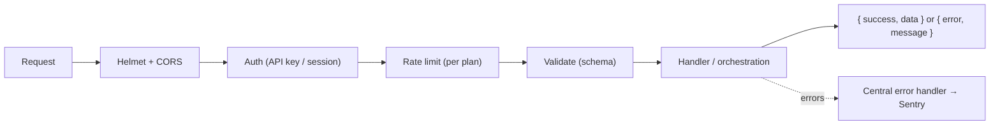
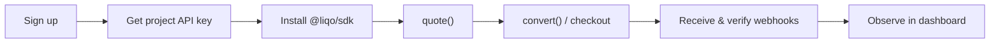

# API Overview

The Liqo API is a RESTful, JSON-over-HTTPS API. This overview covers authentication, conventions, the core endpoints, and the request lifecycle. For a language client, see the [SDK](./SDK.md).

> **Base URL:** the canonical base URL for your account is shown in the [dashboard](./MERCHANT_DASHBOARD.md). Examples below use `https://api.liqo.network/v1` as an illustrative base. Always confirm the exact host from the dashboard.

## Authentication

Most endpoints require an API key in the `Authorization` header:

```http
Authorization: Bearer liqo_test_xxx
```

- Keys are **scoped** to a project and environment (test/live).
- Raw keys are shown **once** at creation; only a prefix and an HMAC hash are stored.
- Keys can be **rotated** at any time.

Dashboard/browser clients may alternatively authenticate with HttpOnly session cookies. See [Security](./SECURITY.md) and [Merchant Dashboard](./MERCHANT_DASHBOARD.md).

## Conventions

- **Content type:** `application/json`.
- **Response envelope:** newer endpoints return `{ "success": true, "data": { … } }`.
- **Errors:** a machine-readable code and a human-readable message:
  ```json
  { "error": "INSUFFICIENT_LIQUIDITY", "message": "Not enough liquidity available for this route." }
  ```
- **Field casing:** camelCase (e.g. `fromAsset`, `recipientWallet`).
- **Idempotency & webhooks:** lifecycle changes are delivered via signed webhooks; verify them with the SDK.

## Core Endpoints

| Method & Path | Purpose |
|---|---|
| `GET /quote` | Get a conversion quote (estimated output, fee, routing path, expiry) |
| `POST /convert` | Convert and deliver the destination asset to a recipient |
| `POST /payout` | Send an asset to a wallet |
| `GET /transaction/:id` | Retrieve transaction status |
| `POST /checkout/sessions` | Create a hosted checkout session |
| `GET /checkout/sessions/:token` | Retrieve a checkout session (public by token) |
| `POST /webhooks` · `GET /webhooks` | Register / list webhook endpoints |
| `POST /organizations` · `POST /projects` | Workspace management |
| `POST /projects/:id/api-keys` | Issue a project API key |

> The full, authoritative endpoint reference (with schemas) is published as an OpenAPI document and rendered in the interactive API docs. This overview is a map, not the complete specification.

### Example: Get a Quote

```http
GET /quote?from=NGN&to=XLM&amount=50000
Authorization: Bearer liqo_test_xxx
```

```json
{
  "fromAsset": "NGN",
  "toAsset": "XLM",
  "inputAmount": 50000,
  "estimatedOutput": 1020,
  "routingPath": ["NGN", "USDC", "XLM"],
  "fee": 0.35,
  "expiresAt": "2026-01-01T00:01:00Z"
}
```

### Example: Convert

```http
POST /convert
Authorization: Bearer liqo_test_xxx
Content-Type: application/json

{ "fromAsset": "NGN", "toAsset": "XLM", "amount": 50000, "recipientWallet": "G...WALLET" }
```

```json
{ "transactionId": "tx_84392", "status": "processing", "estimatedOutput": 1020, "fee": 0.35 }
```

## API Request Lifecycle



## Developer Integration Flow



## Rate Limits

Rate limits are applied per plan. Exceeding them returns a rate-limit error; back off and retry. See your plan details in the dashboard.

## Related

- [SDK](./SDK.md) · [Payment Flow](./PAYMENT_FLOW.md) · [Checkout](./CHECKOUT.md) · [Security](./SECURITY.md)
