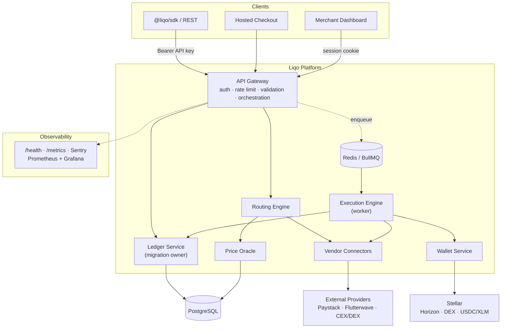

# Architecture

Liqo is a **service-oriented payments platform**. A single public API gateway fronts a set of internal services. Conversions are executed asynchronously through a queue and settled on Stellar. PostgreSQL is the system of record; Redis backs the job queue and caching.

> This is an architectural overview for developers and reviewers. It describes responsibilities and boundaries, not proprietary implementation detail.

## System Architecture

## Components

| Service | Responsibility |
|---|---|
| **API Gateway** | The only public-facing service. Authentication, rate limiting, request validation, and orchestration across internal services. |
| **Routing Engine** | Generates candidate routes and scores them by price, fees, slippage, latency, and provider reliability. |
| **Execution Engine** | Asynchronous worker that executes the chosen route and drives the transaction state machine. |
| **Wallet Service** | Stellar hot-wallet operations, transaction signing, and settlement via Horizon. |
| **Ledger Service** | Canonical accounting record; **sole owner of database migrations**. |
| **Price Oracle** | Price feeds and liquidity monitoring. |
| **Vendor Connectors** | Adapters that implement a common liquidity-provider interface for each external provider. |

## Key Architectural Decisions

- **Single public entry point.** Only the API gateway is exposed; all other services are internal and authenticate service-to-service. This shrinks the attack surface.
- **Asynchronous execution.** Conversions are enqueued and processed by a worker, so the API responds immediately and long-running settlement doesn't block requests.
- **One migration owner.** The ledger service is the single source of schema truth; other services never mutate schema. This prevents migration races.
- **Contract-first.** A shared contracts layer (Zod schemas + an OpenAPI document) keeps the API, SDK, and clients in agreement.
- **Provider abstraction.** Every liquidity source implements the same interface, so adding a provider is additive and isolated.
- **Non-custodial routing.** Liqo orchestrates and settles; it is infrastructure, not a custodial bank.

## Data & Messaging

- **PostgreSQL** — system of record (users, transactions, ledger, workspaces, webhooks, and more).
- **Redis + BullMQ** — job queues for execution and payouts, plus caching and internal event/webhook-delivery workers.
- **Stellar Horizon** — on-chain settlement and monitoring.

## Observability

- `GET /health` and `GET /metrics` (Prometheus) on the gateway.
- Prometheus + Grafana for metrics and dashboards; Sentry for error tracking.

## Related

- [System Design](./SYSTEM_DESIGN.md) — service communication in detail
- [Payment Orchestration](./PAYMENT_ORCHESTRATION.md) — the request lifecycle
- [Settlement Engine](./SETTLEMENT_ENGINE.md) — execution & settlement
- [Security](./SECURITY.md) — the security model
