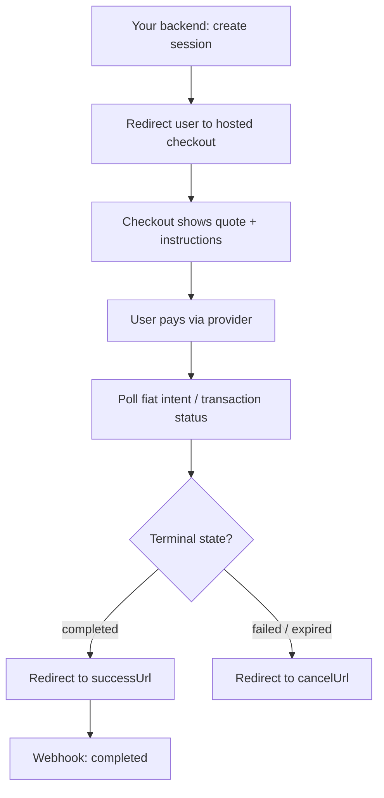

# Checkout

Liqo Checkout is a **hosted payment experience** for fiat pay-in flows. Instead of building payment UI, a platform creates a checkout session and redirects the user to a Liqo-hosted page that collects payment and settles the destination asset.

> The checkout UI is maintained in the `liqo-checkout` repository. This page describes the flow and integration.

## When to Use Checkout

Use hosted checkout when you want Liqo to handle the payment UI and provider redirect — ideal for fiat on-ramp flows (e.g. a user paying in NGN to receive XLM in a wallet).

## Integration

1. **Create a session** from your backend:

   ```ts
   const session = await liqo.checkout.sessions.create({
     amount: 50000,
     currency: "NGN",
     destinationAsset: "XLM",
     targetChain: "stellar",
     successUrl: "https://yourapp.com/success",
     cancelUrl: "https://yourapp.com/cancel",
     metadata: { orderId: "..." },
   });
   ```

2. **Redirect** the user to the session's hosted URL.
3. **User pays** through the hosted page and provider flow.
4. **Receive a webhook** (or poll) for completion; the user is redirected to your `successUrl` or `cancelUrl`.

## The Hosted Flow



## Status & Polling

The checkout page tracks the underlying **fiat intent** and **transaction**, polling until a terminal state (`completed`, `failed`, or `expired`). Your backend should rely on **signed webhooks** as the source of truth, using the redirect only for UX.

## Session Retrieval

A checkout session can be retrieved by its opaque token (public by design — only a hash is stored):

```ts
const session = await liqo.checkout.sessions.retrieve(token);
```

## Security

- Session tokens are opaque; only hashes are stored.
- Treat webhooks as authoritative and verify their signatures (see [SDK](./SDK.md#webhook-verification)).
- Never expose secret API keys in the browser; create sessions from your backend.

## Related

- [SDK](./SDK.md) · [Payment Flow](./PAYMENT_FLOW.md) · [API Overview](./API_OVERVIEW.md)
