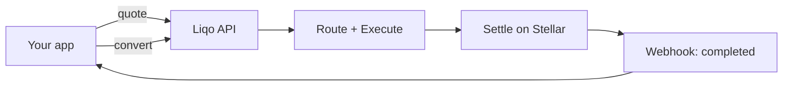

# Introduction

**Liqo is Global Payments Infrastructure for Modern Businesses.** It lets any business accept a payment in one currency — fiat, stablecoins, or crypto — and deliver value in another asset to a destination wallet, through a single API, without holding reserves or integrating providers directly.

## The Problem Liqo Solves

To move money across currencies and assets today, a product team must pre-fund crypto inventory, integrate multiple exchanges and payment processors, build routing and settlement logic, and handle failures and compliance across fragmented corridors. That's months of financial engineering unrelated to their actual product.

Liqo replaces all of it with one integration.

## Core Concepts

| Concept | Meaning |
|---|---|
| **Quote** | An estimate of output amount, fees, and the routing path for a conversion, valid until an expiry. |
| **Convert** | A request to move value from a source currency to a destination asset and deliver it to a recipient. |
| **Route** | A path from source to destination through one or more providers, scored by cost and reliability. |
| **Liquidity Provider** | An external source of liquidity (fiat processor, exchange, DEX, or market maker) behind a common adapter interface. |
| **Settlement** | Final delivery of the destination asset — on Stellar for XLM/USDC. |
| **Ledger** | The canonical accounting record of every transaction and balance movement. |
| **Transaction** | A single conversion moving through the lifecycle: `pending → executing → completed` (or `failed → reverted`). |
| **Webhook** | A signed, retried HTTP callback notifying your app of transaction lifecycle events. |
| **Organization / Project / API Key** | The workspace model: organizations contain projects; projects issue scoped API keys. |

## How Liqo Works (in four steps)

1. **Quote** — your app asks Liqo what a conversion will yield.
2. **Convert** — your app (or a hosted checkout) initiates the conversion.
3. **Route & Execute** — Liqo's routing engine picks the best path; the execution engine runs it through providers.
4. **Settle & Notify** — Liqo settles the destination asset (e.g. on Stellar), records it in the ledger, and emits webhooks.

## Who Liqo Is For

- **Wallet apps** — top-ups and withdrawals
- **Creator platforms** — tips and payouts
- **Marketplaces** — seller settlement
- **Fintechs** — remittances and cross-border flows
- **Payroll tools** — paying contributors in their preferred asset

## Design Principles

Liqo is built to be **simple to integrate, reliable under failure, reserve-less by design, and non-custodial.** See [VISION.md](../VISION.md) for the full set of principles.

## Where to Go Next

- Understand the system → [Architecture](./ARCHITECTURE.md)
- Start building → [API Overview](./API_OVERVIEW.md) and [SDK](./SDK.md)
- See the payment lifecycle → [Payment Flow](./PAYMENT_FLOW.md)
