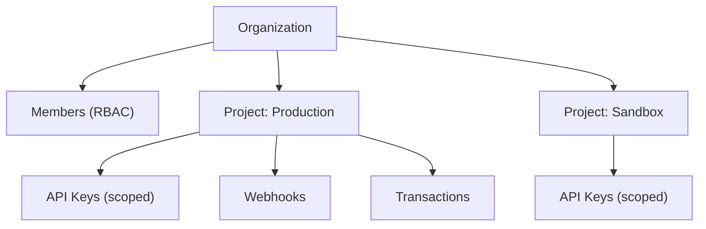

# Merchant Dashboard

The Liqo Dashboard is the **control plane** for developers and merchants: manage your organization, projects, API keys, transactions, webhooks, and settings.

> The dashboard is maintained in the `liqo-dashboard` repository. This page describes its capabilities and the underlying workspace model.

## Workspace Model

- **Organizations** group members and projects.
- **Projects** isolate environments and credentials (e.g. production vs. sandbox).
- **API keys** are issued per project, scoped, and rotatable.

## Capabilities

| Area | What you can do |
|---|---|
| **Authentication** | Register, log in, reset password, manage sessions |
| **Organizations** | Create organizations; invite and manage members |
| **Roles (RBAC)** | Assign roles: owner, admin, developer, viewer |
| **Projects** | Create and manage projects/environments |
| **API keys** | Create, rotate, and revoke scoped keys (shown once) |
| **Transactions** | Inspect status, routes, and settlement |
| **Webhooks** | Register endpoints, send test events, inspect deliveries |
| **Settings** | Profile, preferences, and account management |
| **Billing** | Plan and usage overview |

## Authentication & Sessions

The dashboard authenticates via secure, HttpOnly session cookies issued by the platform (short-lived access token + longer-lived refresh token), in addition to API-key access for programmatic use. See [Security](./SECURITY.md).

## Roles & Permissions

| Role | Typical permissions |
|---|---|
| **Owner** | Full control of the organization |
| **Admin** | Manage projects, members, keys, webhooks |
| **Developer** | Manage keys/webhooks, view transactions |
| **Viewer** | Read-only access |

## API Keys

- Created per project; the raw key is shown **once**.
- Stored as an HMAC hash plus a prefix — never in plaintext.
- Scoped to permissions and an environment (test/live).
- Rotatable and revocable at any time.

## Related

- [API Overview](./API_OVERVIEW.md) · [Security](./SECURITY.md) · [Product](../PRODUCT.md)
