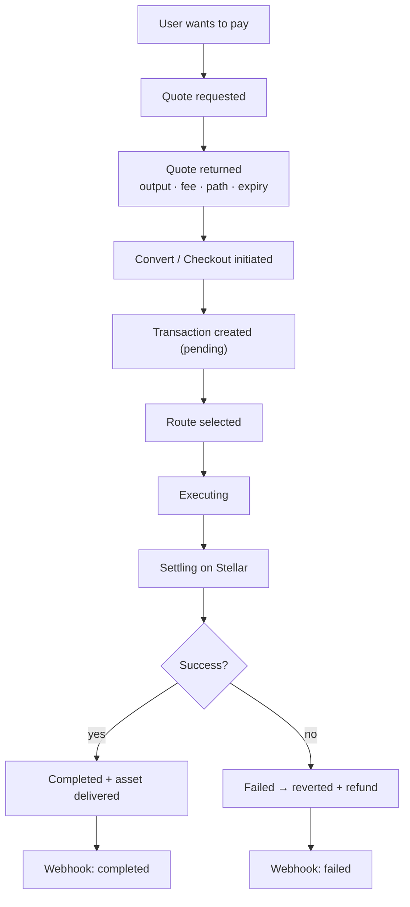
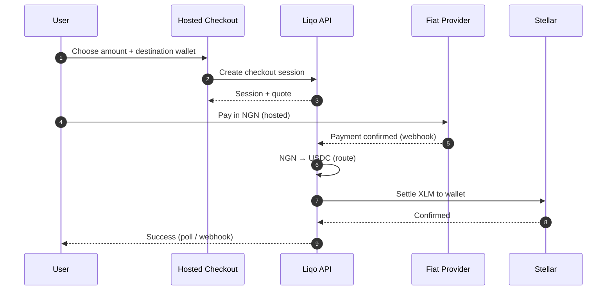

# Payment Flow

This document walks through the end-to-end lifecycle of a payment on Liqo, from a user's intent to final settlement and notification.

## Overview

A payment on Liqo turns a source amount (fiat or crypto) into a destination asset delivered to a wallet. The platform handles routing, execution, settlement, accounting, and notification.

## Step by Step

1. **Quote.** The app requests a quote for `from → to` and an amount. Liqo returns estimated output, fee, the routing path, and an expiry.
2. **Initiate.** The app calls `convert` (or a user completes a hosted checkout session for fiat pay-in).
3. **Create transaction.** A transaction record is created in the ledger with status `pending`.
4. **Route.** The routing engine ranks candidate routes; the best is selected.
5. **Execute.** The execution engine runs the route through the relevant providers (status `executing`).
6. **Settle.** The wallet service settles the destination asset on Stellar and delivers it to the recipient.
7. **Record & notify.** The ledger is updated to `completed`; a signed webhook is emitted.
8. **On failure.** The ledger is reverted, a refund is initiated where applicable, and a `failed` webhook is emitted. Liqo may retry with the next-ranked route.

## Fiat On-Ramp Example: `NGN → XLM`

The canonical on-ramp path is **`Local fiat → USDC → XLM`**.

## Statuses

| Status | Meaning |
|---|---|
| `pending` | Transaction created, not yet executing |
| `executing` | Route is being executed |
| `completed` | Destination asset delivered |
| `failed` | Execution failed |
| `reverted` | Ledger reverted / refund initiated after failure |

## What the Developer Sees

- Immediate response with `transactionId` and `status: processing`.
- `GET /transaction/:id` for polling.
- Signed **webhooks** for lifecycle transitions (recommended over polling).

## Related

- [Payment Orchestration](./PAYMENT_ORCHESTRATION.md) — how routing & execution work internally
- [Settlement Engine](./SETTLEMENT_ENGINE.md) — settlement detail
- [Checkout](./CHECKOUT.md) — hosted fiat pay-in
