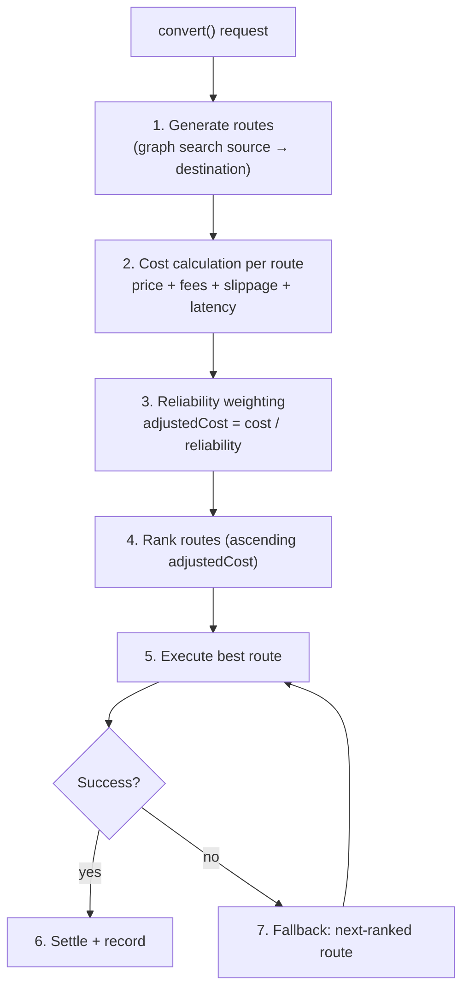
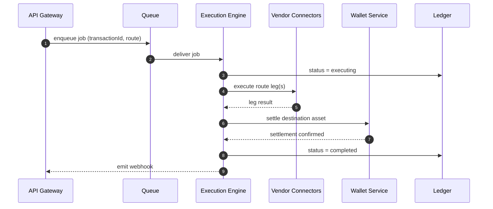

# Payment Orchestration

Payment orchestration is the heart of Liqo: turning a conversion request into a settled transaction by **generating routes, scoring them, executing the best one, and recovering from failure.** This document covers the routing engine, the execution engine, and how they coordinate.

## The Orchestration Pipeline



## 1. Route Generation

Liqo models assets and providers as a graph:

- **Nodes** are assets (USD, NGN, USDC, XLM, …).
- **Edges** are swap paths between assets via a provider.

A depth-limited search finds candidate paths from source to destination, e.g. `NGN → USDC → XLM`.

## 2. Cost Calculation

Each route is costed:

```
cost = price + fees + slippage + latencyPenalty
```

## 3. Reliability Weighting

Costs are adjusted by each provider's reliability, so a slightly cheaper but less reliable route doesn't automatically win:

```
adjustedCost = cost / providerReliabilityScore
```

Provider scoring combines liquidity depth, reliability, price competitiveness, and latency.

## 4. Ranking

Routes are sorted by `adjustedCost` ascending. The top route is chosen for execution; the remainder are retained as fallbacks.

## 5. Execution

The execution engine is an asynchronous worker (backed by the job queue). It:

- Executes each leg of the chosen route through the relevant provider adapter.
- Drives the transaction **state machine** (`pending → executing → completed | failed`).
- Coordinates settlement via the wallet service.
- Updates the ledger at each step.



## 6 & 7. Failure Recovery

Liqo treats failure as a first-class path:

- **Failover:** on a failed route, execution retries with the next-ranked route.
- **Revert & refund:** the internal ledger is reverted and a refund initiated where applicable.
- **Alerting:** failures are logged and surfaced to monitoring.
- **Stuck-transaction handling:** transactions that stall are detected and handled out-of-band.
- **Route splitting (roadmap):** large conversions can be split across multiple providers.

## Why Asynchronous?

Settlement can take seconds to minutes depending on providers and networks. By enqueuing execution and returning immediately, the API stays fast and responsive while the worker handles the long tail — with retries and idempotency making the process resilient.

## Related

- [Settlement Engine](./SETTLEMENT_ENGINE.md) · [System Design](./SYSTEM_DESIGN.md) · [Payment Flow](./PAYMENT_FLOW.md)
