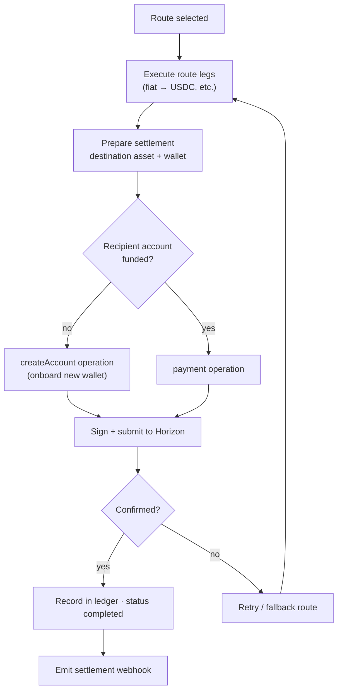

# Settlement Engine

Settlement is the final step of a payment: **delivering the destination asset to the recipient and recording it authoritatively.** For crypto destinations, Liqo settles on the **Stellar network**.

## Responsibilities

- Execute the chosen route's legs through provider adapters.
- Settle the destination asset (on Stellar for XLM/USDC).
- Record every movement in the canonical ledger.
- Drive the transaction state machine and handle failure/refund.

The engine spans two internal services: the **execution engine** (orchestration, state machine) and the **wallet service** (Stellar keys, signing, on-chain settlement).

## Settlement Flow

## Stellar Settlement Details

- **Horizon submission.** The wallet service builds, signs, and submits Stellar transactions via Horizon, then monitors confirmation.
- **New-account onboarding.** If the recipient's Stellar account is not yet funded, settlement uses a `createAccount` operation so first-time recipients are onboarded automatically.
- **Assets.** XLM and USDC on Stellar. The USDC issuer is configurable.
- **Network.** Network and Horizon endpoint are environment-driven (testnet by default in development).

See [Stellar Integration](./STELLAR_INTEGRATION.md) for more.

## The Ledger

Every settlement is recorded in the canonical ledger as balanced entries (debit/credit) tied to a transaction. The ledger service is the single owner of this data and of schema migrations, ensuring a consistent, auditable accounting record.

## Wallet Architecture

Liqo separates wallets by purpose to reduce risk:

| Wallet | Purpose |
|---|---|
| **Hot wallet** | Executes settlement transactions |
| **Settlement wallet** | Temporary wallet for a swap's lifecycle |
| **Cold wallet** | Long-term storage (production hardening) |

Production key custody and multi-signature treasury are part of the mainnet-hardening roadmap (see [SCF.md](../SCF.md)).

## Failure Handling

- Failed settlements trigger ledger reversal and refund where applicable.
- Execution can fall back to the next-ranked route.
- Stuck or unconfirmed transactions are detected and handled.

## Related

- [Stellar Integration](./STELLAR_INTEGRATION.md) · [Payment Orchestration](./PAYMENT_ORCHESTRATION.md) · [Security](./SECURITY.md)
