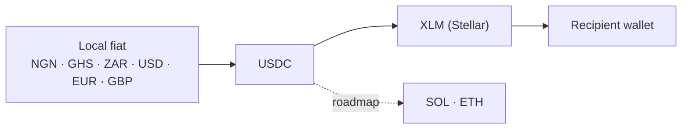

# Stellar Integration

Liqo settles on **Stellar**. This document explains how Liqo uses the network today and what's on the roadmap. For the grant-oriented narrative, see [SCF.md](../SCF.md).

## Why Stellar

Stellar is purpose-built for payments: fast (~3–5s) and low-cost (fractions of a cent) settlement, native stablecoins (USDC), a built-in DEX, and an anchor network aligned with real-world fiat on/off-ramps — exactly Liqo's problem space, especially in emerging markets.

## How Liqo Uses Stellar Today

Liqo **currently leverages Stellar's existing network capabilities for settlement and payment infrastructure**, via the official `@stellar/stellar-sdk` in the platform's wallet service and a Stellar DEX adapter.

### Currently Implemented

| Capability | Status | Description |
|---|---|---|
| Horizon submission & monitoring | ✅ | Build, sign, submit, and confirm transactions via Horizon |
| XLM & USDC settlement | ✅ | Deliver the destination asset to recipient wallets |
| New-account onboarding | ✅ | `createAccount` for unfunded recipient wallets |
| Stellar DEX routing | ✅ | DEX adapter participates in the routing graph |
| Hot-wallet signing | ✅ | Wallet service manages settlement keys |
| Testnet/mainnet config | ✅ | Environment-driven network + Horizon URL |

### Planned Future Work

| Capability | Status | Description |
|---|---|---|
| Programmable payment workflows via Soroban | 🔜 Planned | Not yet integrated. Future roadmap items include programmable payment workflows powered by Soroban where they provide clear value. |

## Assets & Paths

- **Settlement assets:** XLM, USDC (configurable USDC issuer).
- **Canonical on-ramp path:** `Local fiat → USDC → XLM` (e.g. `NGN → USDC → XLM`).
- **Planned assets:** SOL, ETH (multi-chain).

## Network Configuration

Stellar network selection and the Horizon endpoint are environment-driven. Development defaults to **testnet**; production uses **mainnet** (part of the mainnet-hardening roadmap). Liqo does not embed secrets or keys in this public repository.

## Roadmap for Stellar

1. **Mainnet hardening** — production key custody, multi-sig treasury, runbooks.
2. **Crypto-to-fiat off-ramp** — closing the loop back to local fiat.
3. **Deeper path payments & DEX utilization** — richer on-chain routing; route splitting.
4. **Programmable payment workflows (Soroban)** — future roadmap items include programmable payment workflows powered by Soroban where they provide clear value.
5. **Corridor & asset expansion.**

## Honesty Note

Liqo currently leverages Stellar's existing network capabilities for settlement and payment infrastructure (Horizon, DEX, and classic payment operations). Soroban is **not yet integrated**. Future roadmap items include programmable payment workflows powered by Soroban where they provide clear value. See [SCF.md](../SCF.md) for the full assessment.

## Related

- [Settlement Engine](./SETTLEMENT_ENGINE.md) · [SCF / Stellar overview](../SCF.md) · [Architecture](./ARCHITECTURE.md)
