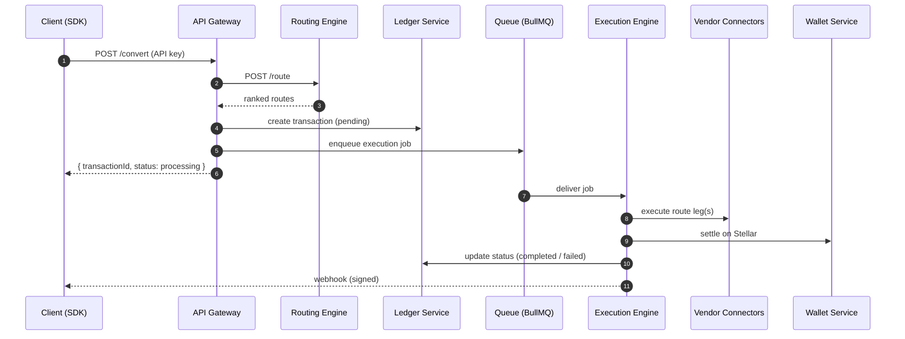
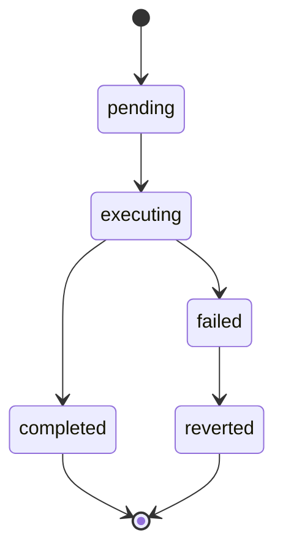

# System Design

This document describes how Liqo's services are organized, what each one owns, and how they communicate.

## Design Goals

- **Small, single-responsibility services** that can be reasoned about and evolved independently.
- **A single public surface** (the API gateway) with everything else internal.
- **Asynchronous, resilient execution** so settlement latency never blocks the API.
- **A single source of truth** for data (PostgreSQL, via the ledger service) and for the API contract (the shared contracts layer).

## Service Communication

Services communicate over HTTP for synchronous calls and via a Redis-backed queue (BullMQ) for asynchronous work. Internal services authenticate one another with a shared internal credential and are never exposed publicly.

## Service Boundaries & Ownership

| Service | Owns | Talks to |
|---|---|---|
| **API Gateway** | Public API, auth, rate limiting, orchestration, webhooks | Routing, Ledger, Queue |
| **Routing Engine** | Route generation & scoring | Vendor Connectors, Price Oracle |
| **Execution Engine** | Async execution, state machine, retries | Vendor Connectors, Wallet, Ledger |
| **Wallet Service** | Stellar keys, signing, settlement | Stellar Horizon |
| **Ledger Service** | Accounting data, **schema migrations** | PostgreSQL |
| **Price Oracle** | Prices, liquidity depth | Stellar, Redis, PostgreSQL |
| **Vendor Connectors** | Provider adapters | External provider APIs |

## Transaction State Machine

Every conversion moves through an explicit lifecycle. Failure states are first-class and recoverable.

On failure, Liqo reverts internal ledger entries, initiates refund where applicable, logs and alerts, and can retry with the next-best route.

## Reliability Patterns

- **Idempotency.** Processed events and webhooks are tracked to make retries safe.
- **Failover routing.** If the best route fails, execution can fall back to the next-ranked route.
- **Route splitting (roadmap).** Large conversions can be split across providers.
- **Dead-letter handling.** Stuck transactions are detected and handled out-of-band.

## Contract-First Development

A shared contracts layer defines request/response schemas (via Zod) and a canonical OpenAPI document. The gateway validates all input against these schemas, and the SDK is generated/aligned to the same contract — so the API, SDK, and dashboard never drift.

## Scalability

- Services are stateless and horizontally scalable behind the queue.
- Long-running work is offloaded to workers, keeping the API responsive.
- PostgreSQL and Redis scale independently of the compute tier.

## Related

- [Architecture](./ARCHITECTURE.md) · [Payment Orchestration](./PAYMENT_ORCHESTRATION.md) · [Settlement Engine](./SETTLEMENT_ENGINE.md)
